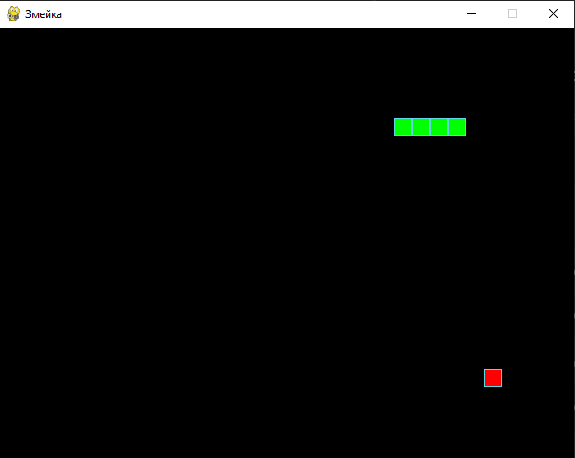

# Классическая игра «Змейка»

Описание игрового процесса:
«Змейка» — это аркадная игра, в которой игрок управляет растущей змеёй, перемещающейся по игровому полю. Цель — собирать яблоки, избегая столкновений.

## Ключевые правила:
  - Управляемая игроком змейка постоянно движется в одном из четырёх направлений (вверх, вниз, влево, вправо);
  - Остановка или движение назад невозможны;
  - Собрав яблоко, змейка увеличивается в длину на один сегмент;
  - Игровое поле замкнуто: при достижении края змейка появляется с противоположной стороны;
  - Игра завершается, если змейка сталкивается с собственным хвостом. В этом случае начинается новый раунд.

## Технологии
  - Python 3.7+
  - Pygame
  - PEP8

## Установка, настройка и запуск

1. Клонировать репозиторий и перейти в него в командной строке:

    ```
    git clone
    ```

    ```
    cd the_snake
    ```

2. Cоздать и активировать виртуальное окружение:

    ```
    python -m venv venv
    ```

    * Если у вас Linux/macOS

        ```
        source venv/bin/activate
        ```

    * Если у вас windows

        ```
        source venv/scripts/activate
        ```

3. Обновить pip и установить зависимости из файла requirements.txt:

    ```
    python -m pip install --upgrade pip
    ```

    ```
    pip install -r requirements.txt
    ```

4. Настроить параметры игры, либо оставить стандартные:
   ```
    SCREEN_WIDTH, SCREEN_HEIGHT = 640, 480  # Размеры окна
    GRID_SIZE = 20                          # Размер ячейки сетки
    SPEED = 20                              # Скорость игры (FPS)
    ```

5. Выполнить запуск

    ```
    python the_snake.py
    ```

## Скриншот игры

